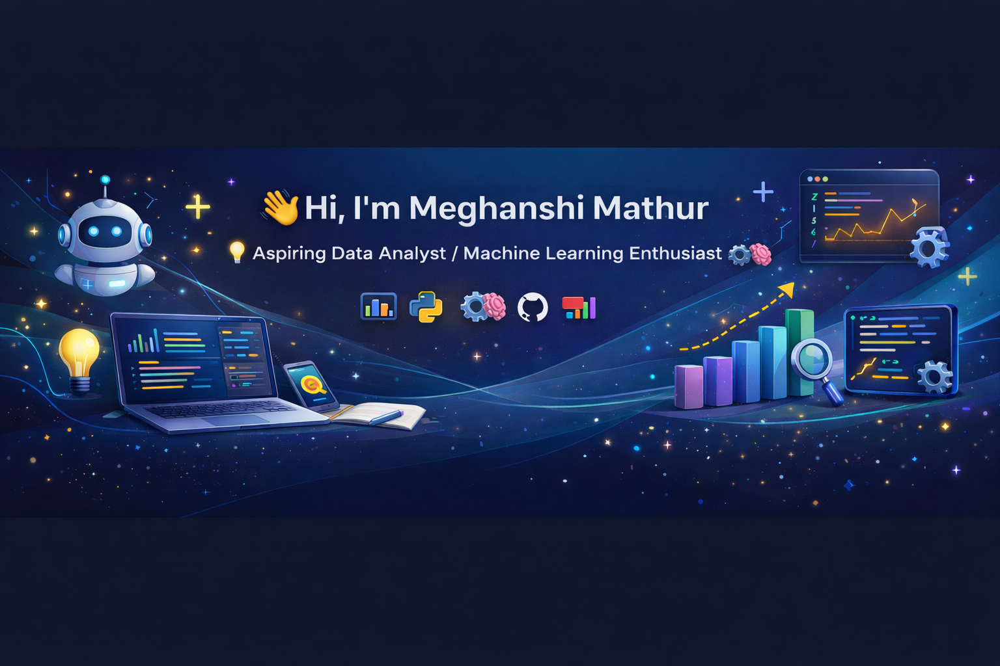

# 👋 Hi, I'm Meghanshi Mathur

🎓 B.Tech in Computer Science | PGDM (AI & Data Science)  
💡 Aspiring Data Analyst / Machine Learning Enthusiast  

---

## 🌸 About Me

I am a Computer Science graduate currently pursuing PGDM in Artificial Intelligence & Data Science.  
I enjoy building real-world AI projects and improving my problem-solving skills through hands-on coding.

I have worked on Machine Learning, Computer Vision, and AI-based applications and I am actively improving my GitHub portfolio.

---

## 🛠 Technical Skills

- Python  
- Machine Learning  
- Data Analysis  
- Computer Vision (OpenCV)  
- SQL  
- Pandas, NumPy, Matplotlib  
- Scikit-learn  
- Streamlit  
- Git & GitHub  

---

## 📂 Featured Projects

### 🔹 Business Plan Checker (AI App)
AI-powered Streamlit application that analyzes business ideas using ML & NLP.

👉 https://github.com/meghanshimathur/Business-Plan-Checker

---

### 🔹 Classic Computer Vision Pipeline
Traditional CV techniques like Harris Corner Detection, edge detection, and feature extraction.

👉 https://github.com/meghanshimathur/Classic-Computer-Vision-Pipeline

---

### 🔹 Xerox Compression Bug
Notebook project focused on debugging image compression issues.

👉 https://github.com/meghanshimathur/Xerox_compression_bug

---

## 🎯 Career Objective

To build a strong career in Data Analytics / AI by applying machine learning to solve real-world problems and continuously improving my technical skills.

---

## 📫 Connect With Me

- GitHub: https://github.com/meghanshimathur  
- LinkedIn: (add your link)

---

✨ Always learning. Always building.
